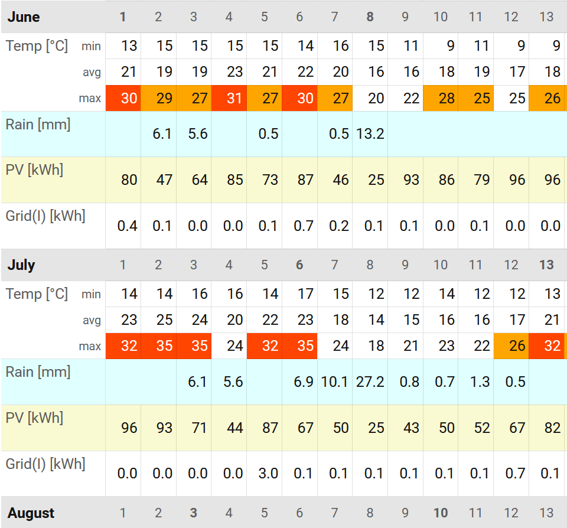

# Calendar Stats Card

A Home Assistant custom Lovelace card that renders dense **monthly statistics tables** for any entity with long-term statistics — temperatures, precipitation, energy meters, custom sensors, or arithmetic expressions over several of them.

One page shows every past month of a year, day-by-day, with min/avg/max and totals.
Future months and today's still-running day are hidden.



> ⚠️ **Disclaimer** — this project is developed using Spec-Driven Development (SDD) and "vibe coding" with AI assistance.
> Treat it accordingly: review the code yourself before relying on it in production-critical setups, and expect rapid iteration over polished engineering.

---

## Features

- **Flexible time ranges** — pick a preset (this month, this quarter, this year, last 3 months, last 12 months) or any custom month-to-month span from the range selector in the floating bottom bar; arrow buttons step the current range backwards and forwards (down to the earliest period with recorded data).
- **Monthly and yearly views** — a Monthly | Yearly toggle in the bottom bar switches between the day-by-day monthly tables and a compact yearly grid.
  The yearly view shows one table per calendar year with one column per month; each cell holds that month's summary (min/avg/max for measurement rows, the monthly total for cumulative rows), plus a per-row yearly Summary and Total.
  In the yearly view the range selector operates on whole calendar years (this year, last year, last 3/5 years, or a custom year span).
- **Per-entity-type rendering** — automatically picks the right display for each entity:
  - `measurement` entities (temperature, humidity, …) → combined min/avg/max in one row per day
  - `total_increasing` / `total` entities (rainfall, electricity meter, …) → daily delta plus monthly total
- **Smart monthly summary** — for `measurement` entities, monthly extremes are computed from the per-day extremes (not from the per-day means as HA does natively).
  For cumulative and expression rows, you decide per row whether zero-value days count toward min/avg/max via the `show_zero` option (default: included).
- **Expression rows** — define a row as an arithmetic formula over several entities, evaluated per day.
- **Threshold colouring** — flag days that go above/below configurable values with per-rule text and background colours; matched rules show in a legend.
- **Predecessor entities** — stitch together history from a sensor that was replaced, with an optional unit-conversion factor.
- **Dense layout** — maximum 4 px cell padding, no decorative whitespace, sticky entity-label column, horizontal scroll per table.
- **Visual editor** — full GUI configuration; no YAML required.
- **i18n** — English and German out of the box.
  Locale follows the HA UI setting automatically.
- **HA-native styling** — uses HA design tokens and Lovelace components; matches your theme.

---

## Installation

### HACS

> **TODO** — not yet listed in HACS.
> Manual install only for now.

<details>
<summary><strong>Manual install</strong></summary>

1. Download the latest `calendar-stats-card.js` from the [Releases](../../releases) page (or build it yourself — see the [contributor guide](../README.md)).
2. Copy the file into your HA config directory, e.g. `<config>/www/calendar-stats/calendar-stats-card.js`.
3. In HA: **Settings → Dashboards → Resources → ＋ Add resource**
   - URL: `/local/calendar-stats/calendar-stats-card.js`
   - Resource type: **JavaScript module**
4. Hard-reload your browser (Ctrl-Shift-R).

</details>

### Add the card to a dashboard

The card is designed for a full-width panel view:

1. Create a new dashboard view, set its **type** to **Panel (1 card)**.
2. Edit the view → **＋ Add card** → search for **Calendar Stats**.
3. The visual editor opens automatically.
   Add at least one entity and you're done.

For YAML users:

```yaml
type: custom:calendar-stats-card
entities:
  - entity: sensor.outdoor_temperature
  - entity: sensor.daily_rainfall
  - entity: sensor.electricity_meter_total
```

---

## Configuration

### Card-level options

| Option   | Type    | Required | Default | Description |
|----------|---------|----------|---------|-------------|
| `type`     | string  | yes | — | Must be `custom:calendar-stats-card`. |
| `entities` | list    | yes | — | Ordered list of entity rows and/or expression rows. |

### Entity row

A single HA entity is rendered as one row.
Display behaviour is derived automatically from the entity's `state_class` and `device_class` — no manual type configuration.

| Option             | Type       | Default            | Description |
|--------------------|------------|--------------------|-------------|
| `entity`             | string     | **required**       | HA entity ID (e.g. `sensor.outdoor_temperature`). Duplicates allowed — each entry produces its own row. |
| `name`               | string     | HA friendly name   | Override the label shown in the first column. |
| `precision`          | integer    | `1`                | Decimal digits shown in day cells and summary columns. Omit to use the default of 1. |
| `factor`             | number     | `1`                | Multiplier applied to every displayed value (raw HA values are kept untouched). Useful for unit scaling (e.g. `0.001` to display Wh as kWh). |
| `unit`               | string     | HA unit            | Override the unit-of-measurement shown beside the label. |
| `show_zero`          | boolean    | `true`             | If `false`, day cells whose computed value is exactly `0` render as blank AND the monthly summary min/avg/max exclude those zero-value days. The monthly `total` is unaffected (zero days contribute zero anyway). Applies uniformly: a counter-reset day clamped to `0` is treated the same as a naturally-zero day. Set explicitly to `false` for precipitation entities if you want the old "exclude no-rain days from the rainfall average" behaviour. |
| `show_min`           | boolean    | `true`             | (Measurement entities) show the min sub-row per day. |
| `show_avg`           | boolean    | `true`             | (Measurement entities) show the avg sub-row per day. |
| `show_max`           | boolean    | `true`             | (Measurement entities) show the max sub-row per day. |
| `text_color`         | string     | theme              | Row-wide text colour. Accepted formats: see [Color values](#color-values). |
| `background_color`   | string     | theme              | Row-wide background colour. Accepted formats: see [Color values](#color-values). |
| `thresholds`         | list       | —                  | Conditional colour rules — see [Threshold rule](#threshold-rule). |
| `predecessors`       | list       | —                  | Historical entities to stitch in — see [Predecessor entry](#predecessor-entry). |

### Expression row

Computes a single per-day value from an arithmetic formula over one or more entity IDs.
Treated as a cumulative row for monthly-summary purposes (sum, then min/avg/max over the daily values).

| Option             | Type       | Default      | Description |
|--------------------|------------|--------------|-------------|
| `expression`         | string     | **required** | Arithmetic formula — entity IDs, numeric literals, `+ - * /` and parentheses. Optionally wrapped in `{{ ... }}`. Example: `{{ sensor.solar_export - sensor.solar_import }}`. |
| `name`               | string     | —            | Label shown in the first column. |
| `unit`               | string     | —            | Unit-of-measurement shown beside the label. |
| `precision`          | integer    | `1`          | Decimal digits in displayed values. Omit to use the default of 1. |
| `show_zero`          | boolean    | `true`       | If `false`, day cells whose computed value is exactly `0` render as blank AND the monthly summary min/avg/max exclude those zero-value days. The monthly `total` is unaffected. |
| `text_color`         | string     | theme        | Row-wide text colour. Accepted formats: see [Color values](#color-values). |
| `background_color`   | string     | theme        | Row-wide background colour. Accepted formats: see [Color values](#color-values). |
| `thresholds`         | list       | —            | Conditional colour rules — see [Threshold rule](#threshold-rule). |

Expression rows do **not** support `factor` (fold it into the expression directly) or `predecessors`.

### Threshold rule

Each entry in a row's `thresholds:` list applies a colour override to day cells whose value satisfies the rule.
Multiple rules can stack; the editor displays a legend for every named rule.

| Option             | Type    | Default         | Description |
|--------------------|---------|-----------------|-------------|
| `operator`           | enum    | **required**    | One of `above`, `equals-above`, `equals-below`, `below`, `not-below`, `not-above`. |
| `value`              | number  | **required**    | Threshold value to compare against. |
| `name`               | string  | —               | Optional label shown in the legend at the bottom of the card. |
| `text_color`         | string  | row default     | Text colour applied to matching cells. Accepted formats: see [Color values](#color-values). |
| `background_color`   | string  | row default     | Background colour applied to matching cells. Accepted formats: see [Color values](#color-values). |

Operator semantics:

| Operator         | Cell value passes when |
|------------------|------------------------|
| `above`            | `value > threshold` |
| `equals-above`     | `value ≥ threshold` |
| `equals-below`     | `value ≤ threshold` |
| `below`            | `value < threshold` |
| `not-below`        | `value ≥ threshold` |
| `not-above`        | `value ≤ threshold` |

### Predecessor entry

Each entry in an entity row's `predecessors:` list points to an earlier HA entity whose statistics should be used for dates strictly before `replaced_on`.
Useful when a sensor was replaced or renamed.

| Option         | Type   | Default      | Description |
|----------------|--------|--------------|-------------|
| `entity`         | string | **required** | HA entity ID of the predecessor sensor. |
| `replaced_on`    | string | —            | ISO date `YYYY-MM-DD`. The predecessor covers dates strictly before this date. Omit to use the predecessor for all dates with no main-entity data. |
| `factor`         | number | `1`          | Multiplier applied to predecessor values (e.g. `1000` if the old sensor reported kWh and the new one reports Wh). Also bypasses the unit-compatibility check. |

### Color values

Every `text_color` and `background_color` option (on rows and on threshold rules) accepts any CSS colour string.
The value is applied as-is to the cell's inline style, so anything the browser understands works:

| Format | Example | Notes |
|---|---|---|
| Named colour | `red`, `white`, `transparent` | The full [CSS named colour](https://developer.mozilla.org/en-US/docs/Web/CSS/named-color) set. |
| Hex (3/4/6/8 digit) | `#f44`, `#ff5252`, `#ff525280` | 8-digit form includes alpha. |
| `rgb()` / `rgba()` | `rgb(255 82 82)`, `rgba(255, 82, 82, 0.5)` | Comma or space syntax. |
| `hsl()` / `hsla()` | `hsl(0 70% 65%)` | Same alpha rules as `rgba()`. |
| HA / theme variable | `var(--error-color)`, `var(--primary-color)` | Pulls the current theme's colour. Common HA tokens: `--primary-color`, `--accent-color`, `--error-color`, `--warning-color`, `--success-color`, `--info-color`, `--primary-text-color`, `--secondary-text-color`, `--card-background-color`, `--divider-color`. |

Tip: prefer HA theme variables when you want the card to follow theme switching (light/dark).
Prefer hex/rgba when you need a specific brand colour regardless of theme.

---

## Examples

### Minimal

```yaml
type: custom:calendar-stats-card
entities:
  - entity: sensor.outdoor_temperature
```

### Temperature + precipitation + energy

```yaml
type: custom:calendar-stats-card
entities:
  - entity: sensor.outdoor_temperature
    name: Outdoor
    precision: 1
  - entity: sensor.daily_rainfall
    name: Rain
    show_zero: false
  - entity: sensor.electricity_meter
    name: Electricity
    factor: 0.001
    unit: kWh
    precision: 2
```

### Threshold colouring (hot/cold days)

```yaml
type: custom:calendar-stats-card
entities:
  - entity: sensor.outdoor_temperature
    name: Outdoor
    precision: 1
    thresholds:
      - operator: above
        value: 30
        name: Hot
        background_color: "#ff5252"
        text_color: white
      - operator: below
        value: 0
        name: Frost
        background_color: "#2196f3"
        text_color: white
```

### Expression row — net solar export

```yaml
type: custom:calendar-stats-card
entities:
  - entity: sensor.solar_export
  - entity: sensor.solar_import
  - expression: "{{ sensor.solar_export - sensor.solar_import }}"
    name: Net solar
    unit: kWh
    precision: 2
```

### Predecessor — sensor was replaced on 2024-06-01

```yaml
type: custom:calendar-stats-card
entities:
  - entity: sensor.electricity_meter_v2
    name: Electricity
    factor: 0.001
    unit: kWh
    predecessors:
      - entity: sensor.electricity_meter_v1
        replaced_on: "2024-06-01"
```

---

## Behaviour & limits

- **Today and future days** are always rendered as empty cells, even when HA has partial data for today.
  "Today" is determined in the HA server's timezone (`hass.config.time_zone`).
- **On load** the card shows the current calendar year (January through the current month); the selected range and view are session-only and reset on reload.
- **Backward navigation** stops at the period containing the earliest recorded data of any configured entity; no fully-empty earlier period is reachable, in either view.
- **Coverage indicator** — a superscript `*` appended to a cell value flags incomplete data: for `measurement` entities, a day with less than 24 h of statistics; for cumulative entities, a day with missing data at its start or end (mid-day gaps render silently).
- **Monthly totals** for cumulative entities are sourced from HA's authoritative monthly statistics (`sum[month] − sum[prev_month]`) and may not exactly equal the arithmetic sum of visible daily cells — this is expected and HA wins.
- **Performance** — tested up to 10 entities; no hard cap is enforced.
- **HA version** — requires 2026.5.0+.
  The card transparently handles the `has_mean` → `mean_type` API change introduced in 2026.11.

## Localization

The card automatically uses the language configured in your HA UI.
Supported locales:

- 🇬🇧 English (`en`)
- 🇩🇪 German (`de`)

To request a new locale, open an issue or PR with a translation file in `frontend/src/translations/`.

## Troubleshooting

- **Card doesn't appear in the card picker** → check the resource URL in **Settings → Dashboards → Resources** and hard-reload the browser.
- **Entity row shows a warning icon** → the entity has no long-term statistics enabled in HA.
  Enable it via **Settings → System → Customize** for that entity, then wait at least one statistics cycle.
- **Cell values have a `*`** → partial-data day.
  See "coverage indicator" above.
- **Monthly total ≠ sum of visible days** → expected.
  HA's monthly-period figure wins.

## Contributing

See the [contributor README](../README.md) at the repo root for build, test, and Speckit workflow.

## License

TBD.
